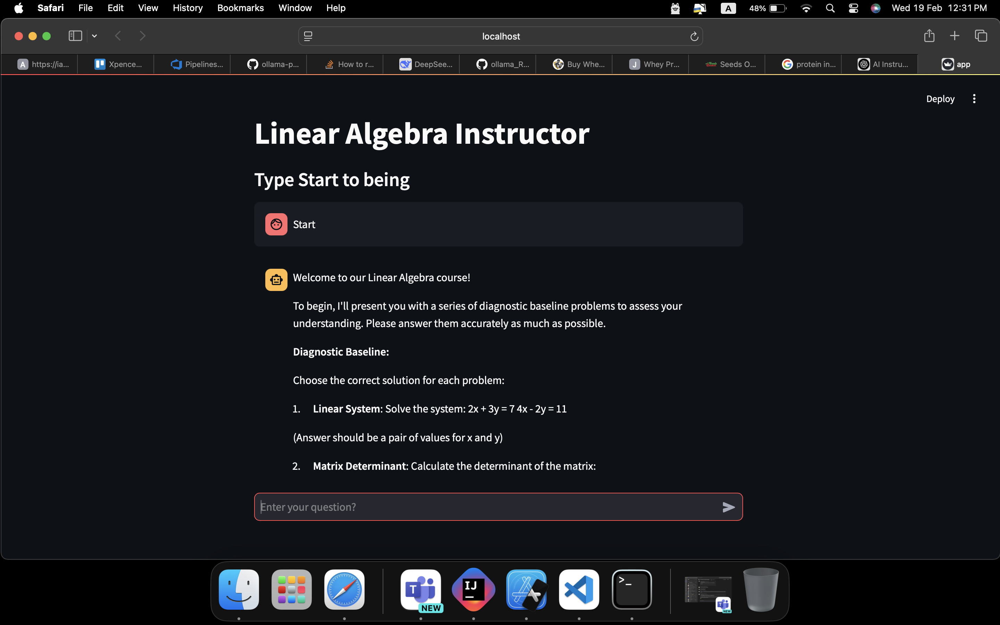
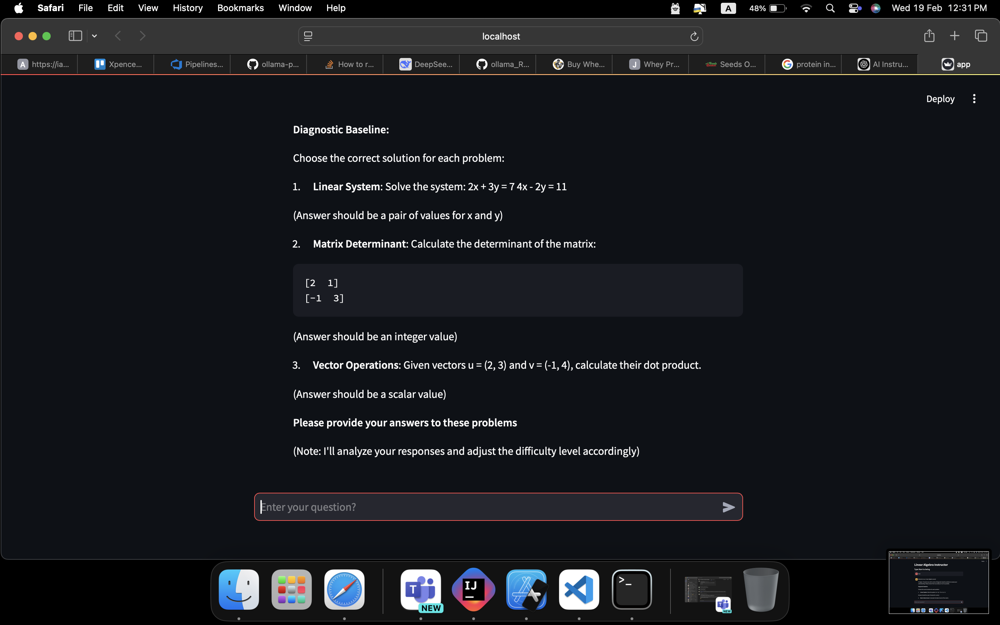
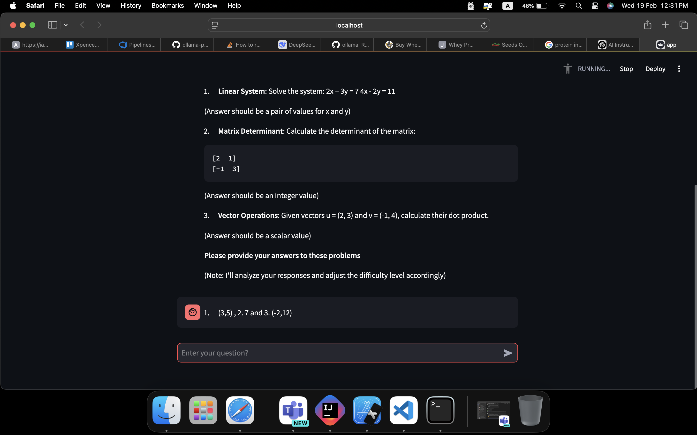
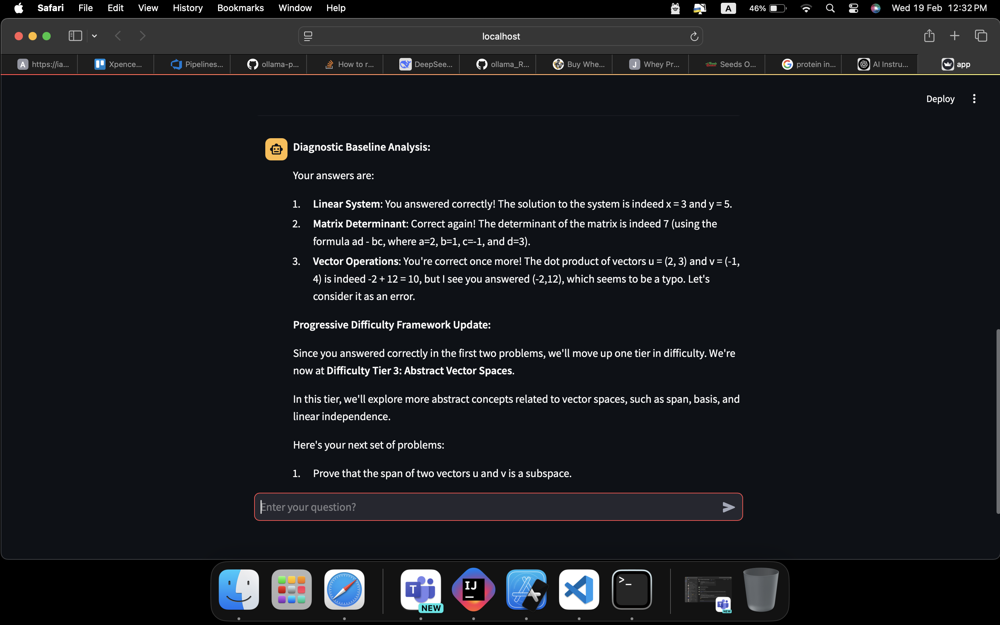

# AI Linear Algebra Instructor 🤖➗

[](https://www.python.org/)
[](https://streamlit.io)

An adaptive learning system that personalizes linear algebra instruction using AI. Dynamically adjusts problem difficulty and provides intelligent hints based on student performance.






*Interactive problem-solving interface with step-by-step guidance*

## Key Features ✨
- **Dynamic Difficulty Adjustment**: Automatically scales problem complexity
- **Intelligent Hint System**: Context-aware assistance without spoiling solutions
- **Performance Analytics**: Real-time skill progression tracking
- **Multi-modal Support**: Visual, algebraic, and geometric representations
- **Error Diagnosis**: Identifies conceptual misunderstandings

## Tech Stack 🛠️
| Component              | Technology                          |
|------------------------|-------------------------------------|
| **AI Engine**          | Ollama LLaMA 3.2:3b (Local LLM)     |
| **UI Framework**       | Streamlit                           |
| **Python Environment** | Python 3.8+ with NumPy/SymPy        |

## Installation & Setup ⚙️

### Prerequisites
- [Ollama](https://ollama.ai) installed and running
- Python 3.8+ with pip

1. **Configure Ollama Model**:
```bash
ollama pull llama3.2:3b
```

2. **Set Up Python Environment**:
```bash
python -m venv .venv
source .venv/bin/activate  # Linux/MacOS
# .venv\Scripts\activate  # Windows
pip install -r requirements.txt
```

**Sample requirements.txt**:

```bash
ollama>=0.1.2
streamlit>=1.32.0
numpy>=1.26.0
sympy>=1.12

```

## Usage 🚀

**Start the application**:

```bash
streamlit run app.py
```

## ⚠️ Disclaimer

The AI-generated answers may not always be accurate or reliable. Always verify critical mathematical solutions independently.